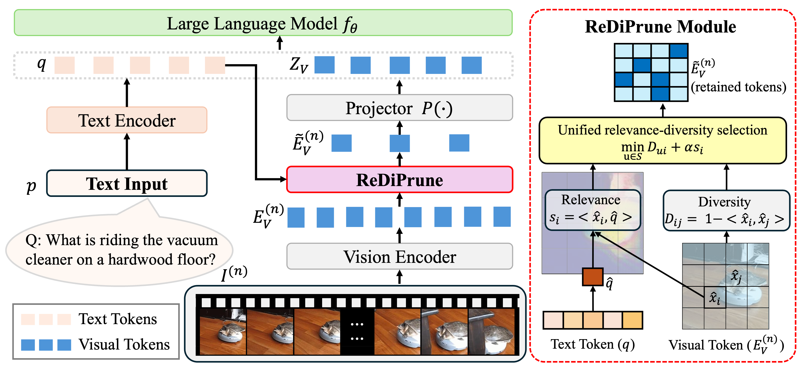

# ReDiPrune: Relevance-Diversity Pre-Projection Token Pruning for Efficient Multimodal LLMs. 

An Yu, Ting Yu Tsai, Zhenfei Zhang, Weiheng Lu, Felix X. -F. Ye, and Ming-Ching Chang

The repo for ReDiPrune: Relevance-Diversity Pre-Projection Token Pruning for Efficient Multimodal LLMs. [[Arxiv]](https://arxiv.org/abs/2603.24680) 

## Overview

We introduce ReDiPrune, a training-free visual token pruning method for improving the efficiency of multimodal large language models. Our key idea is to prune tokens before the vision-language projector, where visual features are still rich and discriminative, instead of pruning after projection on compressed representations. To preserve both usefulness and coverage, we score tokens with a lightweight rule that jointly considers text-conditioned relevance and max-min diversity, so the selected tokens are both query-relevant and non-redundant. ReDiPrune is fully plug-and-play, requires no retraining or architectural changes, and can be seamlessly integrated into existing MLLM pipelines.

<div align="center" width="100%">
  
</div>

## Setup Environment
```sh
conda create -n rediprune python=3.10 -y
conda activate rediprune
conda install pytorch==2.1.2 torchvision==0.16.2 pytorch-cuda=11.8 -c pytorch -c nvidia
pip install torchaudio==2.0.2+cu118 --index-url https://download.pytorch.org/whl/cu118
pip install -r requirements.txt
cd LLaVA-NeXT
pip install -e .
cd ..
```

---

## Evaluation
You can use the following script to reproduce the results for ReDiPrune.

We use **VideoChatGPT** as the example evaluation task in `run_rediprune.sh`.

The default pretrained model is set to **lmms-lab/LLaVA-NeXT-Video-7B-DPO**. Feel free to change the pretrained model in `--model_args` to evaluate other models.

The default retained ratio is set to **0.1**. Adjust `SUBSET_RATIO` to test other pruning ratios. You can also modify `LAYER_INDEX` to apply pruning at different layers.

You can adjust these environment variables to test other pruning settings.

```sh
bash ./run_rediprune.sh
```
---

## Efficiency 
The following script calculates the memory usage and latency for ReDiPrune using the VideoChatGPT example run.
 ```sh 
python3 ./extract_time.py --path ./logs/radiprune_llava_videochatgpt/rediprune_llava_videochatgpt.log
```
---

## Citation 
If you find this code useful, please cite the relevant papers in your work.
```
@article{Yu2026ReDiPrune,
  title = {{ReDiPrune: Relevance-Diversity Pre-Projection Token Pruning for Efficient Multimodal LLMs}},
  author = {Yu, An and Tsai, Ting Yu and Zhang, Zhenfei and Lu, Weiheng and Ye, Felix X. -F. and Chang, Ming-Ching},
  year = {2026},
  journal = {arXiv preprint arXiv:2603.24680},
  url = {https://arxiv.org/abs/2603.24680},
  doi = {10.48550/arXiv.2603.24680},
}
```

---

## References
Our code is built upon [lmms-eval](https://github.com/EvolvingLMMs-Lab/lmms-eval), [LLaVA](https://github.com/haotian-liu/LLaVA), [LLaVA-NeXT](https://github.com/LLaVA-VL/LLaVA-NeXT), and [DivPrune](https://github.com/vbdi/divprune).  
We sincerely thank the authors and contributors of these projects for their excellent work.

---
## License
This project is released under the Apache 2.0 License. See the [LICENSE](LICENSE) file for details.